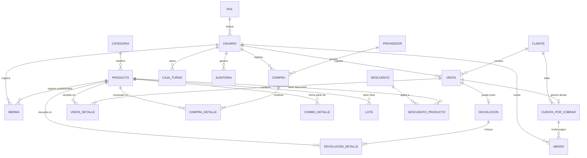

# 🥃 Sistema de Licorería - Plan de Implementación v3.0 (ULTRA-DETALLADO)

> Documento maestro de arquitectura, módulos, base de datos, flujos de proceso y plan de ejecución.

---

## 1. STACK TECNOLÓGICO COMPLETO

| Capa | Tecnología | Versión | Justificación |
|---|---|---|---|
| **Lenguaje** | JavaScript (ES6+) | — | Universal, gran ecosistema |
| **Framework Frontend** | Next.js (React) | 14+ (App Router) | SSR/CSR, API Routes integradas, rendimiento extremo |
| **Estilos** | CSS Puro (Variables + Glassmorphism) | CSS3 | Control total del diseño premium, Dark Mode nativo |
| **Tipografía** | Google Fonts (Inter) | — | Moderna, legible en pantallas POS |
| **Framework Backend** | Next.js API Routes (Node.js) | — | Backend y frontend en un solo deploy |
| **Base de Datos** | PostgreSQL | 15+ | ACID, transacciones seguras, JSON nativo |
| **ORM** | Prisma ORM | 5+ | Migraciones automáticas, type-safe, relaciones fáciles |
| **Autenticación** | NextAuth.js + bcrypt | — | Sesiones seguras, hash de contraseñas |
| **Gráficas** | Chart.js (react-chartjs-2) | — | Gráficas de barras, líneas y pastel para reportes |
| **Generación PDF** | jsPDF + html2canvas | — | Facturas y reportes exportables a PDF |
| **Códigos de Barras** | JsBarcode | — | Generar e imprimir etiquetas de código de barras |
| **Iconos** | Lucide React | — | Iconos modernos y ligeros para el dashboard |

---

## 2. CATÁLOGO COMPLETO DE MÓDULOS (15 Módulos)

### 2.1. 🔐 Módulo de Autenticación y Seguridad
**Propósito:** Controlar quién accede al sistema y qué puede hacer.

| Funcionalidad | Detalle |
|---|---|
| Login seguro | Usuario + contraseña hasheada con bcrypt (salt de 12 rondas) |
| Sesiones con token | Manejadas por NextAuth.js, expiran tras inactividad configurable |
| Bloqueo por intentos | Después de 5 intentos fallidos, la cuenta se bloquea por 15 minutos |
| Cierre forzado | El administrador puede cerrar la sesión de cualquier usuario remotamente |

**Roles y Permisos Detallados:**

| Permiso | Administrador | Cajero | Almacenista |
|---|---|---|---|
| Ver Dashboard completo | ✅ | ❌ (solo ventas del día) | ❌ |
| Crear/Editar productos | ✅ | ❌ | ✅ |
| Cambiar precios | ✅ | ❌ | ❌ |
| Realizar ventas (POS) | ✅ | ✅ | ❌ |
| Anular ventas | ✅ | ❌ | ❌ |
| Hacer devoluciones | ✅ | ❌ | ❌ |
| Registrar compras | ✅ | ❌ | ✅ |
| Gestionar proveedores | ✅ | ❌ | ✅ |
| Ver reportes de ganancias | ✅ | ❌ | ❌ |
| Gestionar usuarios | ✅ | ❌ | ❌ |
| Aplicar descuentos manuales | ✅ | Solo con código de autorización | ❌ |
| Ver auditoría | ✅ | ❌ | ❌ |
| Apertura/Cierre de caja | ✅ | ✅ (solo su caja) | ❌ |

---

### 2.2. 📊 Dashboard Principal (Home)
**Propósito:** Vista general del estado del negocio en tiempo real.

| Widget | Datos que muestra |
|---|---|
| 💰 Ventas del Día | Total en dinero + número de transacciones (actualizado en tiempo real) |
| 📦 Productos con Stock Bajo | Lista de productos que están por debajo del stock mínimo (alerta roja) |
| 🏆 Top 5 Más Vendidos | Gráfica de barras con los 5 productos más vendidos de la semana |
| 📈 Ventas de los Últimos 7 Días | Gráfica de línea mostrando la tendencia de ventas |
| 💳 Cuentas por Cobrar | Total de deudas pendientes de todos los clientes |
| 🕐 Últimas 10 Ventas | Tabla con las ventas más recientes (hora, cajero, monto) |
| 🔔 Notificaciones | Productos vencidos, stock bajo, cierres de caja pendientes |

---

### 2.3. 📦 Módulo de Inventario (Avanzado)
**Propósito:** Control total del almacén de la licorería.

| Funcionalidad | Detalle |
|---|---|
| CRUD de Productos | Crear, ver, editar, desactivar (nunca borrar, para preservar historial) |
| Categorías | Rones, Whiskys, Vodkas, Cervezas, Vinos, Refrescos, Snacks, Cigarrillos, Hielo, Otros |
| Campos del Producto | Código de barras, nombre, marca, descripción, contenido (ml/L), grado alcohólico (%), imagen, categoría, precio de compra, precio de venta al detal, precio de venta al mayor, stock actual, stock mínimo, unidad de medida (botella/caja/unidad), es_combo (sí/no), activo (sí/no) |
| **Precio Mayor vs. Detal** (NUEVO) | Cada producto tiene DOS precios de venta: uno para el público (detal) y otro para bares/restaurantes (al mayor). El cajero selecciona cuál aplicar al momento de vender |
| **Conversión Caja→Botellas** | Al registrar un producto, se define cuántas unidades trae la caja (ej. caja de 24 cervezas). El sistema permite comprar cajas y vender unidades, descontando proporcionalmente |
| **Control de Lotes y Vencimiento** (NUEVO) | Cada entrada de mercancía puede tener un número de lote y fecha de vencimiento. El sistema alerta cuando un lote está próximo a vencer (configurable: 30, 15, 7 días antes) |
| Mermas y Roturas | Pantalla para registrar pérdidas (botella rota, producto dañado). Se descuenta del stock SIN generar una venta, y queda registrado en auditoría con motivo |
| **Generación de Etiquetas** (NUEVO) | Desde la ficha del producto, un botón permite generar e imprimir una etiqueta con código de barras + nombre + precio, para pegar en la estantería |
| Búsqueda avanzada | Buscar por nombre, código de barras, categoría, marca, o rango de precio |

---

### 2.4. 🛒 Módulo de Combos
**Propósito:** Crear productos virtuales que agrupan otros productos reales.

| Funcionalidad | Detalle |
|---|---|
| Crear combo | Seleccionar N productos con sus cantidades (ej. 1 Ron + 2 Refrescos + 1 Hielo) |
| Precio del combo | Se establece un precio fijo para el combo (generalmente menor que la suma individual) |
| Descuento del inventario | Al vender el combo, se descuentan las unidades individuales del stock de cada producto ingrediente |
| Activar/Desactivar | Los combos pueden activarse solo en ciertos horarios o fechas |

---

### 2.5. 🏷️ Módulo de Descuentos y Promociones (NUEVO)
**Propósito:** Gestionar ofertas sin depender de cambiar el precio del producto.

| Funcionalidad | Detalle |
|---|---|
| Descuento por porcentaje | Ej. "20% en todos los vinos este fin de semana" |
| Descuento por monto fijo | Ej. "$5 de descuento en compras mayores a $50" |
| Descuento por cantidad | Ej. "Compra 3, paga 2" (2x1, 3x2) |
| Fecha de vigencia | Cada promoción tiene fecha de inicio y fin. Se activa/desactiva automáticamente |
| Aplicación por categoría | Puede aplicarse a una categoría completa (ej. todas las Cervezas) o a productos específicos |
| Descuento manual | El cajero puede aplicar un descuento especial, pero SOLO con un código de autorización del administrador. Queda registrado en auditoría |

---

### 2.6. 💰 Módulo de Punto de Venta (POS) — La Caja
**Propósito:** La pantalla principal donde el cajero escanea y cobra. DEBE SER ULTRA-RÁPIDA.

**Flujo de una venta paso a paso:**
```
1. El cajero escanea el código de barras → El producto aparece en la lista al instante
2. Se repite para cada producto
3. Si hay un combo activo, el sistema lo sugiere ("¿Desea agregar el Combo Noche?")
4. El cajero puede modificar cantidad o eliminar una línea
5. Si hay un descuento activo aplicable, se aplica automáticamente
6. El cajero presiona "Cobrar"
7. Selecciona método de pago: Efectivo / Tarjeta / Transferencia / Crédito (Fiado)
   - Si es Efectivo: ingresa el monto recibido → el sistema calcula el cambio
   - Si es Crédito: selecciona al cliente → el sistema verifica que no supere su límite
8. Se genera la factura/ticket
9. El stock se descuenta automáticamente
10. La venta queda registrada en auditoría
```

| Funcionalidad | Detalle |
|---|---|
| Escáner de código de barras | Listener de teclado que detecta entrada rápida + Enter (emulación de teclado USB) |
| Búsqueda manual | Si no tiene código, buscar por nombre con autocompletado instantáneo |
| Selección Mayor/Detal | Botón toggle para cambiar entre precio al mayor y precio al detal |
| Agregar cliente | Opcional. Si se asocia un cliente, su compra queda en su historial |
| Pago mixto | Parte en efectivo + parte en tarjeta (se registran ambos métodos) |
| Ticket / Factura | Se genera un ticket con: número de factura, fecha, hora, cajero, productos, subtotal, descuento, impuesto, total, método de pago |
| Anulación de venta | Solo el administrador puede anular. Se genera una nota de anulación y el stock regresa |

---

### 2.7. 🧾 Módulo de Facturación
**Propósito:** Generar documentos formales de venta.

| Funcionalidad | Detalle |
|---|---|
| Numeración automática | Cada factura tiene un número correlativo único (configurable: ej. FAC-000001) |
| Datos del negocio | Nombre de la licorería, dirección, teléfono, RIF/NIT (configurables desde Ajustes) |
| Formato de impresión | Formato de ticket térmico (80mm) optimizado para impresoras POS |
| Exportar a PDF | Opción de descargar la factura en PDF |
| Reimprimir | Poder reimprimir cualquier factura pasada desde el historial de ventas |

---

### 2.8. 🏦 Módulo de Caja y Turnos
**Propósito:** Controlar el efectivo del negocio por turno de trabajo.

**Flujo de un turno:**
```
1. APERTURA: El cajero inicia su turno e ingresa cuánto efectivo tiene en la gaveta
2. OPERACIÓN: Durante el turno, cada venta en efectivo se suma al esperado
3. CIERRE: Al finalizar, el cajero cuenta el efectivo real
4. CUADRE: El sistema compara:
   - Esperado = Apertura + Ventas en efectivo - Devoluciones en efectivo
   - Real = Lo que el cajero contó
   - Diferencia = Real - Esperado (positivo = sobrante, negativo = faltante)
5. El administrador revisa y aprueba el cierre
```

| Funcionalidad | Detalle |
|---|---|
| Apertura de caja | Registro del monto inicial + usuario + fecha/hora |
| Solo 1 caja abierta por usuario | Un cajero no puede abrir otra caja sin cerrar la actual |
| Retiros parciales | Si se acumula mucho efectivo, el administrador puede registrar un retiro parcial de la gaveta |
| Cierre de caja | Monto esperado vs. real, con campo de observaciones |
| Historial | Lista de todos los turnos con filtro por fecha y usuario |

---

### 2.9. 👥 Módulo de Clientes
**Propósito:** Gestionar la base de clientes y sus créditos.

| Funcionalidad | Detalle |
|---|---|
| Registro de cliente | Nombre, teléfono, cédula/RIF, dirección, email (opcional), tipo (particular/negocio) |
| Tipo de precio | Al asociar un cliente a una venta, se puede aplicar automáticamente precio "mayor" si es un negocio |
| Límite de crédito | Monto máximo de fiado permitido por cliente. Al intentar excederlo, el sistema BLOQUEA la venta a crédito |
| Saldo pendiente | Vista en tiempo real de cuánto debe cada cliente |
| Historial de compras | Todas las ventas asociadas a ese cliente |

---

### 2.10. 💳 Módulo de Cuentas por Cobrar y Abonos
**Propósito:** Controlar las deudas de los clientes que compran a crédito (fiado).

**Flujo de una venta a crédito:**
```
1. El cajero realiza la venta y selecciona "Crédito" como método de pago
2. Selecciona al cliente → El sistema verifica su límite de crédito
3. Si tiene cupo disponible → Se crea la venta + Se genera una Cuenta por Cobrar
4. El cliente viene a abonar → Se registra el Abono (monto + método de pago + fecha)
5. Cuando el saldo llega a $0 → La cuenta se marca como "Pagada"
```

| Funcionalidad | Detalle |
|---|---|
| Lista de cuentas pendientes | Filtrar por cliente, fecha, estado (pendiente/pagada/vencida) |
| Registrar abono | Monto parcial o total, seleccionar método de pago del abono |
| Fecha límite | Cada cuenta tiene una fecha máxima de pago |
| Vista de morosos | Clientes con cuentas vencidas (resaltados en rojo) |
| Reporte de cartera | Total de dinero que te deben todos los clientes |

---

### 2.11. 🔄 Módulo de Devoluciones (Notas de Crédito)
**Propósito:** Registrar devoluciones sin destruir el historial de ventas.

**Flujo de una devolución:**
```
1. El administrador busca la venta original por número de factura
2. Selecciona los productos a devolver y la cantidad
3. Indica el motivo (producto defectuoso, error de cobro, etc.)
4. El sistema:
   a. Crea una Nota de Crédito vinculada a la venta original
   b. Incrementa el stock de los productos devueltos
   c. Registra la acción en la auditoría
5. Si el pago fue en efectivo → Se descuenta del cierre de caja
6. Si fue a crédito → Se descuenta de la cuenta por cobrar del cliente
```

---

### 2.12. 🚚 Módulo de Compras y Proveedores
**Propósito:** Gestionar la entrada de mercancía al almacén.

| Funcionalidad | Detalle |
|---|---|
| CRUD de Proveedores | Nombre, teléfono, email, RIF/NIT, dirección, persona de contacto |
| Registro de Compra | Seleccionar proveedor → Escanear productos entrantes → Ingresar cantidades y precios de compra |
| Número de factura del proveedor | Se registra el # de factura que te da el proveedor para referencia |
| Actualización automática de stock | Al guardar la compra, el stock de cada producto se incrementa |
| Actualización de precio de compra | Si el proveedor subió el precio, el sistema lo actualiza y te muestra la diferencia vs. el precio anterior |
| **Lote y Vencimiento** (NUEVO) | Al recibir mercancía, puedes ingresar el # de lote y la fecha de vencimiento de cada producto |
| Historial por proveedor | Ver todas las compras hechas a un proveedor específico |

---

### 2.13. 📈 Módulo de Reportes y Analíticas
**Propósito:** Información visual para tomar decisiones de negocio.

| Reporte | Tipo de Gráfica | Datos |
|---|---|---|
| Ventas por Día/Semana/Mes | 📊 Línea | Total vendido en el período seleccionado |
| Top 10 Productos Más Vendidos | 📊 Barras horizontales | Productos ordenados por unidades vendidas |
| Top 10 Productos Más Rentables | 📊 Barras | Productos ordenados por ganancia (precio venta - precio compra) |
| Ventas por Categoría | 🥧 Pastel (Pie) | % de ventas por cada categoría (Rones 35%, Cervezas 40%...) |
| Ventas por Método de Pago | 🥧 Pastel | % Efectivo vs. Tarjeta vs. Transferencia vs. Crédito |
| Inventario Valorizado | 📋 Tabla | Valor total del inventario actual (cantidad × precio de compra) |
| Productos con Stock Crítico | 📋 Tabla con alerta | Productos donde stock actual < stock mínimo |
| **Productos Próximos a Vencer** (NUEVO) | 📋 Tabla con alerta amarilla/roja | Productos cuyo lote vence en los próximos 7/15/30 días |
| Reporte de Cierres de Caja | 📋 Tabla | Historial de aperturas/cierres con diferencias |
| Reporte de Cuentas por Cobrar | 📋 Tabla | Deudas pendientes por cliente, con antigüedad |
| Reporte de Compras | 📊 Barras | Cuánto se gastó en compras por mes/proveedor |
| **Reporte de Mermas** (NUEVO) | 📋 Tabla | Botellas rotas/dañadas: cantidad, motivo, valor perdido |

---

### 2.14. 📝 Módulo de Auditoría / Bitácora
**Propósito:** Registrar TODA acción importante para seguridad y control.

| Acción registrada | Datos que se guardan |
|---|---|
| Venta realizada | Usuario, productos, total, método de pago, fecha/hora |
| Venta anulada | Usuario que anuló, motivo, venta original |
| Devolución procesada | Usuario, productos devueltos, motivo |
| Precio cambiado | Usuario, producto, precio anterior → precio nuevo |
| Producto creado/editado | Usuario, campos modificados |
| Descuento manual aplicado | Usuario que autorizó, monto, venta |
| Apertura/Cierre de caja | Usuario, montos, diferencia |
| Merma registrada | Usuario, producto, cantidad, motivo |
| Login/Logout | Usuario, hora, IP |

---

### 2.15. ⚙️ Módulo de Configuración (NUEVO)
**Propósito:** Ajustes generales del sistema, sin tocar código.

| Configuración | Detalle |
|---|---|
| Datos del negocio | Nombre de la licorería, dirección, teléfono, RIF/NIT, logo |
| Formato de factura | Prefijo (FAC-), número inicial, datos legales |
| Impuestos | Porcentaje de IVA u otros impuestos (configurable, puede ser 0%) |
| Moneda | Símbolo ($, Bs, €) y formato de decimales |
| Días de alerta de vencimiento | Cuántos días antes alertar por productos próximos a vencer |
| Tiempo de bloqueo por intentos | Minutos de bloqueo después de N intentos fallidos de login |

---

## 3. BASE DE DATOS COMPLETA — 22 TABLAS

### 3.1. Diagrama Entidad-Relación Completo



### 3.2. Detalle de TODAS las Tablas (Campo por Campo)

---

#### 🔐 SEGURIDAD

**Tabla: `Rol`**
| Campo | Tipo | Restricción | Descripción |
|---|---|---|---|
| id | INT | PK, Auto | Identificador único |
| nombre | VARCHAR(50) | UNIQUE, NOT NULL | "Administrador", "Cajero", "Almacenista" |
| permisos | JSON | NOT NULL | Objeto JSON con cada permiso en true/false |
| created_at | TIMESTAMP | DEFAULT NOW | Fecha de creación |

**Tabla: `Usuario`**
| Campo | Tipo | Restricción | Descripción |
|---|---|---|---|
| id | INT | PK, Auto | Identificador único |
| nombre | VARCHAR(100) | NOT NULL | Nombre completo del empleado |
| email | VARCHAR(150) | UNIQUE, NOT NULL | Correo o usuario de login |
| password_hash | VARCHAR(255) | NOT NULL | Contraseña hasheada con bcrypt |
| rol_id | INT | FK→Rol, NOT NULL | Rol asignado |
| activo | BOOLEAN | DEFAULT true | Si está desactivado, no puede loguearse |
| intentos_fallidos | INT | DEFAULT 0 | Contador de intentos de login fallidos |
| bloqueado_hasta | TIMESTAMP | NULLABLE | Fecha/hora hasta la que está bloqueado |
| ultimo_login | TIMESTAMP | NULLABLE | Última vez que inició sesión |
| created_at | TIMESTAMP | DEFAULT NOW | Fecha de creación |

---

#### 📦 INVENTARIO

**Tabla: `Categoria`**
| Campo | Tipo | Restricción | Descripción |
|---|---|---|---|
| id | INT | PK, Auto | Identificador único |
| nombre | VARCHAR(100) | UNIQUE, NOT NULL | Ej. "Rones", "Cervezas" |
| descripcion | TEXT | NULLABLE | Descripción opcional |
| activo | BOOLEAN | DEFAULT true | Categoría visible o no |

**Tabla: `Producto`**
| Campo | Tipo | Restricción | Descripción |
|---|---|---|---|
| id | INT | PK, Auto | Identificador único |
| codigo_barras | VARCHAR(50) | UNIQUE, NULLABLE | Código EAN/UPC del escáner |
| nombre | VARCHAR(200) | NOT NULL | Nombre del producto |
| marca | VARCHAR(100) | NULLABLE | Marca del licor |
| descripcion | TEXT | NULLABLE | Descripción adicional |
| contenido_ml | INT | NULLABLE | Contenido en mililitros (750, 1000, 355...) |
| grado_alcoholico | DECIMAL(4,1) | NULLABLE | Grado alcohólico (ej. 40.0%) |
| imagen_url | TEXT | NULLABLE | Ruta o URL de la imagen |
| categoria_id | INT | FK→Categoria, NOT NULL | Categoría a la que pertenece |
| precio_compra | DECIMAL(12,2) | NOT NULL | Último precio al que se compró |
| precio_venta_detal | DECIMAL(12,2) | NOT NULL | Precio de venta al público |
| precio_venta_mayor | DECIMAL(12,2) | NULLABLE | Precio de venta al mayor (bares, restaurantes) |
| stock | INT | NOT NULL, DEFAULT 0 | Unidades disponibles actualmente |
| stock_minimo | INT | NOT NULL, DEFAULT 5 | Cuando stock < stock_minimo → alerta |
| unidad_medida | VARCHAR(20) | NOT NULL, DEFAULT 'unidad' | "unidad", "caja", "botella" |
| unidades_por_caja | INT | NULLABLE | Si aplica, cuántas unidades trae una caja |
| es_combo | BOOLEAN | DEFAULT false | true si es un producto virtual (combo) |
| activo | BOOLEAN | DEFAULT true | Desactivado = no aparece en búsquedas ni POS |
| created_at | TIMESTAMP | DEFAULT NOW | Fecha de creación |
| updated_at | TIMESTAMP | ON UPDATE NOW | Última modificación |

**Tabla: `ComboDetalle`**
| Campo | Tipo | Restricción | Descripción |
|---|---|---|---|
| id | INT | PK, Auto | Identificador único |
| combo_id | INT | FK→Producto, NOT NULL | El producto que ES el combo |
| producto_id | INT | FK→Producto, NOT NULL | El producto ingrediente |
| cantidad | INT | NOT NULL | Cuántas unidades del ingrediente incluye |

**Tabla: `Lote` (NUEVA)**
| Campo | Tipo | Restricción | Descripción |
|---|---|---|---|
| id | INT | PK, Auto | Identificador único |
| producto_id | INT | FK→Producto, NOT NULL | Producto al que pertenece este lote |
| numero_lote | VARCHAR(50) | NULLABLE | Número del lote del fabricante |
| fecha_vencimiento | DATE | NULLABLE | Fecha de caducidad |
| cantidad | INT | NOT NULL | Unidades de este lote específico |
| compra_detalle_id | INT | FK→CompraDetalle | Compra en la que ingresó este lote |
| created_at | TIMESTAMP | DEFAULT NOW | Fecha de registro |

**Tabla: `Merma` (NUEVA)**
| Campo | Tipo | Restricción | Descripción |
|---|---|---|---|
| id | INT | PK, Auto | Identificador único |
| producto_id | INT | FK→Producto, NOT NULL | Producto afectado |
| cantidad | INT | NOT NULL | Unidades perdidas |
| motivo | VARCHAR(200) | NOT NULL | "Botella rota", "Producto vencido", "Robo" |
| usuario_id | INT | FK→Usuario, NOT NULL | Quién registró la merma |
| fecha | TIMESTAMP | DEFAULT NOW | Cuándo ocurrió |

---

#### 🏷️ PROMOCIONES

**Tabla: `Descuento`**
| Campo | Tipo | Restricción | Descripción |
|---|---|---|---|
| id | INT | PK, Auto | Identificador único |
| nombre | VARCHAR(100) | NOT NULL | "Promo Fin de Semana", "2x1 Cervezas" |
| tipo | VARCHAR(20) | NOT NULL | "porcentaje", "monto_fijo", "cantidad" (ej. 3x2) |
| valor | DECIMAL(10,2) | NOT NULL | El % o el monto de descuento |
| cantidad_requerida | INT | NULLABLE | Para tipo "cantidad": compra N unidades |
| cantidad_cobrada | INT | NULLABLE | Para tipo "cantidad": paga M unidades |
| fecha_inicio | DATE | NOT NULL | Desde cuándo aplica |
| fecha_fin | DATE | NOT NULL | Hasta cuándo aplica |
| activo | BOOLEAN | DEFAULT true | Habilitado/Deshabilitado manualmente |

**Tabla: `DescuentoProducto` (NUEVA — tabla intermedia)**
| Campo | Tipo | Restricción | Descripción |
|---|---|---|---|
| id | INT | PK, Auto | Identificador único |
| descuento_id | INT | FK→Descuento, NOT NULL | El descuento aplicable |
| producto_id | INT | FK→Producto, NOT NULL | El producto que recibe el descuento |

---

#### 👥 CLIENTES Y CRÉDITOS

**Tabla: `Cliente`**
| Campo | Tipo | Restricción | Descripción |
|---|---|---|---|
| id | INT | PK, Auto | Identificador único |
| nombre | VARCHAR(150) | NOT NULL | Nombre del cliente o negocio |
| telefono | VARCHAR(20) | NULLABLE | Número de contacto |
| cedula_rif | VARCHAR(20) | UNIQUE, NULLABLE | Documento de identidad |
| direccion | TEXT | NULLABLE | Dirección física |
| email | VARCHAR(150) | NULLABLE | Correo electrónico |
| tipo | VARCHAR(20) | DEFAULT 'particular' | "particular" o "negocio" (para precio mayor) |
| limite_credito | DECIMAL(12,2) | DEFAULT 0 | Máximo que puede deber |
| saldo_pendiente | DECIMAL(12,2) | DEFAULT 0 | Cuánto debe actualmente |
| activo | BOOLEAN | DEFAULT true | Cliente activo/inactivo |
| created_at | TIMESTAMP | DEFAULT NOW | Fecha de registro |

**Tabla: `CuentaPorCobrar`**
| Campo | Tipo | Restricción | Descripción |
|---|---|---|---|
| id | INT | PK, Auto | Identificador único |
| cliente_id | INT | FK→Cliente, NOT NULL | Cliente que debe |
| venta_id | INT | FK→Venta, NOT NULL | Venta que originó la deuda |
| monto_total | DECIMAL(12,2) | NOT NULL | Monto original de la deuda |
| saldo_pendiente | DECIMAL(12,2) | NOT NULL | Lo que queda por pagar |
| fecha_limite | DATE | NULLABLE | Fecha máxima de pago |
| estado | VARCHAR(20) | DEFAULT 'pendiente' | "pendiente", "pagada", "vencida" |
| created_at | TIMESTAMP | DEFAULT NOW | Fecha de creación |

**Tabla: `Abono`**
| Campo | Tipo | Restricción | Descripción |
|---|---|---|---|
| id | INT | PK, Auto | Identificador único |
| cuenta_id | INT | FK→CuentaPorCobrar, NOT NULL | Cuenta que se abona |
| monto | DECIMAL(12,2) | NOT NULL | Monto abonado |
| metodo_pago | VARCHAR(30) | NOT NULL | "efectivo", "tarjeta", "transferencia" |
| usuario_id | INT | FK→Usuario, NOT NULL | Quién recibió el abono |
| fecha | TIMESTAMP | DEFAULT NOW | Fecha del abono |

---

#### 🚚 COMPRAS

**Tabla: `Proveedor`**
| Campo | Tipo | Restricción | Descripción |
|---|---|---|---|
| id | INT | PK, Auto | Identificador único |
| nombre | VARCHAR(150) | NOT NULL | Nombre de la empresa proveedora |
| telefono | VARCHAR(20) | NULLABLE | Teléfono del proveedor |
| email | VARCHAR(150) | NULLABLE | Correo del proveedor |
| rif_nit | VARCHAR(30) | NULLABLE | Documento fiscal |
| direccion | TEXT | NULLABLE | Dirección |
| contacto | VARCHAR(100) | NULLABLE | Persona de contacto |
| activo | BOOLEAN | DEFAULT true | Proveedor activo/inactivo |
| created_at | TIMESTAMP | DEFAULT NOW | Fecha de registro |

**Tabla: `Compra`**
| Campo | Tipo | Restricción | Descripción |
|---|---|---|---|
| id | INT | PK, Auto | Identificador único |
| proveedor_id | INT | FK→Proveedor, NOT NULL | Proveedor de la mercancía |
| usuario_id | INT | FK→Usuario, NOT NULL | Quién registró la compra |
| num_factura_proveedor | VARCHAR(50) | NULLABLE | # de factura del proveedor |
| fecha | TIMESTAMP | DEFAULT NOW | Fecha de la compra |
| total | DECIMAL(12,2) | NOT NULL | Total pagado |
| observaciones | TEXT | NULLABLE | Notas adicionales |

**Tabla: `CompraDetalle`**
| Campo | Tipo | Restricción | Descripción |
|---|---|---|---|
| id | INT | PK, Auto | Identificador único |
| compra_id | INT | FK→Compra, NOT NULL | Compra a la que pertenece |
| producto_id | INT | FK→Producto, NOT NULL | Producto comprado |
| cantidad | INT | NOT NULL | Unidades recibidas |
| precio_unitario | DECIMAL(12,2) | NOT NULL | Precio por unidad |
| subtotal | DECIMAL(12,2) | NOT NULL | cantidad × precio_unitario |

---

#### 💰 VENTAS Y FACTURACIÓN

**Tabla: `Venta`**
| Campo | Tipo | Restricción | Descripción |
|---|---|---|---|
| id | INT | PK, Auto | Identificador único |
| num_factura | VARCHAR(20) | UNIQUE, NOT NULL | Número correlativo (FAC-000001) |
| cliente_id | INT | FK→Cliente, NULLABLE | Cliente (null = venta anónima/mostrador) |
| usuario_id | INT | FK→Usuario, NOT NULL | Cajero que realizó la venta |
| fecha | TIMESTAMP | DEFAULT NOW | Fecha y hora exacta |
| subtotal | DECIMAL(12,2) | NOT NULL | Suma antes de descuentos e impuestos |
| descuento_total | DECIMAL(12,2) | DEFAULT 0 | Total de descuentos aplicados |
| impuesto | DECIMAL(12,2) | DEFAULT 0 | Impuesto calculado |
| total | DECIMAL(12,2) | NOT NULL | Monto final a pagar |
| metodo_pago | VARCHAR(30) | NOT NULL | "efectivo", "tarjeta", "transferencia", "credito", "mixto" |
| monto_efectivo | DECIMAL(12,2) | DEFAULT 0 | Parte pagada en efectivo (para pago mixto) |
| monto_tarjeta | DECIMAL(12,2) | DEFAULT 0 | Parte pagada con tarjeta |
| monto_transferencia | DECIMAL(12,2) | DEFAULT 0 | Parte pagada por transferencia |
| descuento_id | INT | FK→Descuento, NULLABLE | Promoción aplicada (si la hubo) |
| caja_turno_id | INT | FK→CajaTurno, NULLABLE | Turno de caja en el que se realizó |
| estado | VARCHAR(20) | DEFAULT 'completada' | "completada", "anulada" |

**Tabla: `VentaDetalle`**
| Campo | Tipo | Restricción | Descripción |
|---|---|---|---|
| id | INT | PK, Auto | Identificador único |
| venta_id | INT | FK→Venta, NOT NULL | Venta a la que pertenece |
| producto_id | INT | FK→Producto, NOT NULL | Producto vendido |
| cantidad | INT | NOT NULL | Unidades vendidas |
| precio_unitario | DECIMAL(12,2) | NOT NULL | Precio al momento de la venta |
| descuento_linea | DECIMAL(12,2) | DEFAULT 0 | Descuento aplicado en esta línea |
| subtotal | DECIMAL(12,2) | NOT NULL | (cantidad × precio) - descuento |
| tipo_precio | VARCHAR(10) | DEFAULT 'detal' | "detal" o "mayor" |

---

#### 🔄 DEVOLUCIONES

**Tabla: `Devolucion`**
| Campo | Tipo | Restricción | Descripción |
|---|---|---|---|
| id | INT | PK, Auto | Identificador único |
| venta_id | INT | FK→Venta, NOT NULL | Venta original |
| usuario_id | INT | FK→Usuario, NOT NULL | Administrador que procesó |
| fecha | TIMESTAMP | DEFAULT NOW | Fecha de la devolución |
| motivo | TEXT | NOT NULL | Razón de la devolución |
| total_reembolsado | DECIMAL(12,2) | NOT NULL | Monto devuelto al cliente |

**Tabla: `DevolucionDetalle`**
| Campo | Tipo | Restricción | Descripción |
|---|---|---|---|
| id | INT | PK, Auto | Identificador único |
| devolucion_id | INT | FK→Devolucion, NOT NULL | Devolución a la que pertenece |
| producto_id | INT | FK→Producto, NOT NULL | Producto devuelto |
| cantidad | INT | NOT NULL | Unidades devueltas |
| razon | VARCHAR(200) | NULLABLE | Razón específica de este producto |

---

#### 🏦 OPERACIONES

**Tabla: `CajaTurno`**
| Campo | Tipo | Restricción | Descripción |
|---|---|---|---|
| id | INT | PK, Auto | Identificador único |
| usuario_id | INT | FK→Usuario, NOT NULL | Cajero del turno |
| fecha_apertura | TIMESTAMP | NOT NULL | Cuándo abrió la caja |
| fecha_cierre | TIMESTAMP | NULLABLE | Cuándo cerró (null = aún abierta) |
| monto_apertura | DECIMAL(12,2) | NOT NULL | Efectivo al iniciar |
| monto_cierre_esperado | DECIMAL(12,2) | NULLABLE | Calculado por el sistema |
| monto_cierre_real | DECIMAL(12,2) | NULLABLE | Lo que contó el cajero |
| diferencia | DECIMAL(12,2) | NULLABLE | Real - Esperado |
| retiros | DECIMAL(12,2) | DEFAULT 0 | Retiros parciales durante el turno |
| estado | VARCHAR(20) | DEFAULT 'abierta' | "abierta", "cerrada" |
| observaciones | TEXT | NULLABLE | Notas del cierre |

**Tabla: `Auditoria`**
| Campo | Tipo | Restricción | Descripción |
|---|---|---|---|
| id | INT | PK, Auto | Identificador único |
| usuario_id | INT | FK→Usuario, NOT NULL | Quién realizó la acción |
| accion | VARCHAR(50) | NOT NULL | "VENTA", "ANULACION", "CAMBIO_PRECIO", "LOGIN", etc. |
| tabla_afectada | VARCHAR(50) | NOT NULL | Nombre de la tabla afectada |
| registro_id | INT | NULLABLE | ID del registro afectado |
| datos_anteriores | JSON | NULLABLE | Estado ANTES del cambio |
| datos_nuevos | JSON | NULLABLE | Estado DESPUÉS del cambio |
| ip_address | VARCHAR(45) | NULLABLE | IP del usuario |
| fecha | TIMESTAMP | DEFAULT NOW | Fecha y hora exacta |

**Tabla: `Configuracion` (NUEVA)**
| Campo | Tipo | Restricción | Descripción |
|---|---|---|---|
| id | INT | PK, Auto | Identificador único |
| clave | VARCHAR(50) | UNIQUE, NOT NULL | Nombre del setting (ej. "nombre_negocio") |
| valor | TEXT | NOT NULL | Valor del setting |
| descripcion | VARCHAR(200) | NULLABLE | Explicación del setting |

---

## 4. PLAN DE EJECUCIÓN — 14 FASES

| # | Fase | Tablas involucradas | Estimación |
|---|---|---|---|
| 1 | Inicializar Next.js + Prisma + PostgreSQL | — | Base técnica |
| 2 | Esquema completo de BD (22 tablas) | TODAS | Fundación de datos |
| 3 | Login + Roles + Permisos | Rol, Usuario | Seguridad |
| 4 | Dashboard principal con widgets y gráficas | (Consultas) | Vista general |
| 5 | Categorías + Productos + Búsqueda | Categoria, Producto | Inventario base |
| 6 | Combos (crear, editar, desactivar) | ComboDetalle | Agrupación |
| 7 | Proveedores + Compras + Lotes/Vencimiento | Proveedor, Compra, CompraDetalle, Lote | Entrada de mercancía |
| 8 | Punto de Venta (POS) + Escáner | Venta, VentaDetalle | Core del negocio |
| 9 | Facturación (ticket + PDF) | Venta, Configuracion | Documentos |
| 10 | Clientes + Cuentas por Cobrar + Abonos | Cliente, CuentaPorCobrar, Abono | Créditos |
| 11 | Descuentos y Promociones | Descuento, DescuentoProducto | Ofertas |
| 12 | Devoluciones (Notas de Crédito) | Devolucion, DevolucionDetalle | Post-venta |
| 13 | Caja y Turnos + Mermas | CajaTurno, Merma | Operaciones |
| 14 | Reportes + Auditoría + Configuración | Auditoria, Configuracion | Analíticas |

---

> [!IMPORTANT]
> **Este plan cubre 15 módulos, 22 tablas y 14 fases de desarrollo.** Cada tabla tiene todos sus campos documentados. ¿Apruebas este plan para comenzar a programar?
